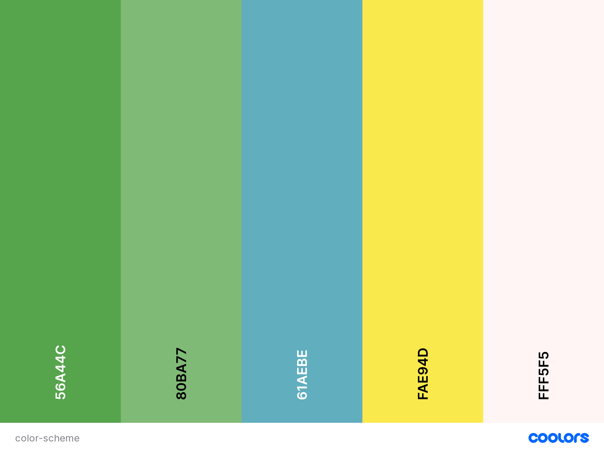

# **Ways**

## **Goal for this project** 

Ways - Experience a new way of travelling
Ways is a NGO engaged in Youth work, primarily focused on hosting and participating in Erasmus+ Youth exchanges and Training courses. 
On this site you can find out what Ways have to offer, what projects are coming up and how to apply for them.
The website will give the users a understanding of what a Youth project is and how it looks like through images and blogs. 

It is important that the users find it easy to navigate and find the information needed to make informed decisions on participation. 

Thank you for visiting my project!
If you have any feedback or questions, head over to my GitHub contact details and feel free to reach out to me.

---

## **UX**

### **User Goals**

* Offer information about Youth
* Website should be easy to use on desktop, tablet & mobile
* Appealing visual elements with connection to youth work
* Personal info of key members of staff
* Offer testimonials through blogs and pictures
* Contact details should be easy to find
* Form to ask questions to the organisation should be visible

[Back to Top](#table-of-contents)

### **User Stories**

###### A first time visitor to this website, 
   - I want to easily navigate around and have a navigation that is easily understood.
   - I want a responsive website on any device, that gives me a good user experience. 
   - I want to understand what the organsation is doing, and how it can contribute to what i am looking for. 
   - I want to see other peoples experiences with the organisation and what they have gotten out of it.
   - I want to understand what is demanded of me, if i make use of the organisation.
   - I want to easily be able to contact the organisation, if i have any questions.
   - I want to be able to see upcoming events, and what the project is about. 
   

 ###### As a returning visitor, 
   - I want to see how i can contribute to the organisation. 
   - I want to quickly be able to see where i can sign up for a project. 
   - I want to know who to contact if i will go into collaboration with the organisation.
   - I want to be able to find pictures and stories from past projects, to see if it is something i fit into. 
   - I want to find the organisations social media accounts, to keep up to date with any communication they are running. 
   - I want to know who the key members are, and how to contact them.

### **Site owners Goals**
* Increase awareness about Erasmus+ Youth projects.
* Increase participation.
* Give young people an opportunity of a lifetime.

[Back to Top](#table-of-contents)

### **User Requirements and Expectations**

#### Requirements
* Easy to navigate by using the navigation menu
* useful information about youth projects
* Appealing visual elements
* Easy way to contact the organisation
* Clear information on how to contact, if users have any questions

#### Expectations 
* When clicking on links (like social media), I expect the page to open in a seperate browser
* I expect that the website looks clean, and that it it easy to understand the information on the website
* I expect that the navigation links work properly, so i am taken, where they say they will take me
* I expect to quickly understand what the website is about, and what i can do with it
* I expect it to be easy to get in contact with the organization, if i have any questions
* I expect to be able to easily navigate around on any device

[Back to Top](#table-of-contents)

### **Design Choices**
As Ways target youth that want to travel out in Europe, i have tried to keep the colors light and with many colors. Ways already have a [logo](assets/images/ways-logo.png " logo"), and i will use the same colors, as in the logo throughout the side. The colors are mostly used as dividers and details, as the website will be kept clean in a nice white color.  

I have used [Coolors](https://coolors.co/ "Coolors.co") to come up with a color scheme that fits the overall feeling of Ways as a brand. 

#### Fonts
In order to find the fonts that best fit with Ways as a brand, I have visited [Google Fonts](https://fonts.google.com/ "Google Fonts") to explore the various options.
For the overall content I have decided to use the [Montserrat](https://fonts.google.com/specimen/Montserrat?query=monts "Google fonts: Montserrat") font. This font is very neutral, and gives a clean and easy readable text. 
I have chosen a different font for my headings, as i want them to stand out in relation to the rest of the text. The font I chose for this, is the [Cairo](https://fonts.google.com/specimen/Cairo?query=cairo "Google Fonts: Cairo") font.
The Cairo font is not very far visually from the Montserrat font, but enough to make it stand out as different. 

#### Icons
I have used icons from the [Font Awesome library](https://fontawesome.com/ "Font Awesome"). The icons fit with the corresponding features that the users of the website are to understand. The visual aspect will make it easier to make a fast intepretation of what the text is about.
I will make sure that the icons are styled according to the website. The icons will act as a supplement to the text. I will keep them small and clean to not overtake the text, as that is not the intention. 

#### Colors
The color scheme is based on [Ways logo](assets/images/ways-logo.png "Ways logo"). I will emplement the same colors on the website as there are used in the logo. 
You can view my color scheme [here](https://coolors.co/56a44c-80ba77-61aebe-ffed4b-fff5f5).
Below I will explain more why I choose the various colors and for what I will be using them.

* #56A44C: This color will be used as my primary background-color. It is the green color from the Ways logo. It will give a nice streamlined effect throughout the website. 
* #FFF5F5: This is a suttle white color. It will be used for the text throughout the page. It will stand out well from the green background.
* #80BA77: This color will be used as text color for the overall contact of the page. It's a mint cream (off white) which stands out well to the background colors that I have chosen.
* #b9d8b4: This is a slightly lighter Green than #56A44C and will be used in various places throughout the page, as a substitute for #56A44C.
* #FAE94D: This is a sweet Yellow color that will be used as a divider throughout the page. It also links back to the logo of Ways. 

I have used to contract checker on Coolors in order to make sure that the contract is sufficient.
This way my content will be easily readable. 

#### Structure
The website structure is built with [Bootstrap](https://getbootstrap.com/).
Bootstrap provides content for both CSS and JavaScript, as functionality with both is important.
As Bootstrap is designed for mobile first, I will be certain that my website functions well on mobile. This also go hand in hand with the target group of Ways, who are young people. They will most likely be using mobiles rather than desktop. 

[Back to Top](#table-of-contents)

--- 

## **Wireframes**
I have decided to use [Balsamic](https://balsamiq.com/wireframes/) to create wireframes for my website. 
First I created a wireframe for mobile, as the approach is mobile first. Thereafter wireframes for desktop and tablets. 
For my website I have decided to go for a 1 page, as that keeps up with current trends. But it is also to suit the target group, as young people do not want to go through many steps. 
The website will be easy to navigate by using the navigation bar or by scrolling down the page. 

You can find my wireframes below:

### [Desktop Wireframe](wireframes/desktop-wireframe.png)

### [Tablet Wireframe](wireframes/tablet-wireframe.png)

### [Mobile Wireframe](wireframes/mobile-wireframe.png)

[Back to Top](#table-of-contents)

---

## **Features**

### **Existing Features**

#### Navigation
For the navbar I have used Boostrap to create a responsive navbar. 
There is a Logo in the left side of the nav-bar that will always bring you back to the top. 
For the user to easily navigate through the site i have fixed each menu point to the place on the site it corresponds to and fixed the nav bar to the top. In this way the user can always just push the tab in the nav bar, when they wish to find something.

#### Hero Image

I have decided to implement a hero image which spreads over 100% width of the screen. The Hero image is a photo from a project of Ways, in this way showcasing the projects Ways stand for. 
The image will be responsive on desktop and tablet, also filling out 100% of the screen there.

#### Welcome Section

Here I used the grid from Bootstrap to create 3 colums on desktop view. On mobile they change into 3 different sections, and on tablet one of them will be hidden.

#### About us Section

The about us section will have a circled image in the middle with 6 setences around it, that illustrates what kind of organsiation Ways is. 

#### Meet the team

For this section i have used the bootstrap grid to make 5 columns that will all host one team member. in each section there will be a picture and a title of the person.
Every image also got an ID where I added the background-image and in some cases I overwrote the position to be more appealing. On tablets only 4 people of the team will be visible and be in two rows. On Mobile the team will be presented one at a time, as the user scrolls down the page. 

#### Contact 
At the contact there will be a form to reach out to us at the organisation, if anyone has any questions. 
Below the form there is a submit button, which also triggers a modal to open up which gives feedback to the user that the form has been successfully submitted.

#### Footer
In the footer there will be a link back to the top of the page. Furthermore there will be links to all the social accounts of the organisation.

### **Features to be implemented**

* Gallery with pictures from various projects 
* Event calendar with dates of future projects
* interactive map with coming projects and former projects on
* A blog page with stories from former projects 
* A news page, with news relating to Ways and Erasmus + projects in general.

[Back to Top](#table-of-contents)

## **Technologies used**

### **Languages**

* [HTML](https://en.wikipedia.org/wiki/HTML)
* [CSS](https://en.wikipedia.org/wiki/Cascading_Style_Sheets)
* [JavaScript](https://en.wikipedia.org/wiki/JavaScript)

### **Libraries & Frameworks**

* [Font Awesome](https://fontawesome.com/)
* [Bootstrap](https://getbootstrap.com/)
* [Google Fonts](https://fonts.google.com/)

### **Tools**
* [Git](https://git-scm.com/)
* [GitPod](https://www.gitpod.io/)
* [Balsamic](https://balsamiq.com/wireframes/)
* [W3C HTML Validation Service](https://validator.w3.org/)
* [W3C CSS Validation Service](https://jigsaw.w3.org/css-validator/)

[Back to Top](#table-of-contents)

## **Testing**
(missing)

### Navigation bar

* **Plan**    

* **Implementation**   

* **Test**    

* **Result**    

* **Verdict**    

### Modals
* **Plan**    

* **Implementation**    

* **Test**    

* **Result**    

* **Verdict**    
 

### Contact Form 
* **Plan**    

* **Implementation**    

* **Test**    

* **Result**    

* **Verdict**    

[Back to Top](#table-of-contents)

### Bugs
(missing)
#### Form validation

* **Bug**    

* **Fix**        

* **Verdict**    

#### Hero Image

* **Bug**    
 

* **Fix**    

* **Verdict**    

#### Hamburger dropdown menu

* **Bug**    

* **Verdict**   

#### Icons

* **Bug**    

* **Fix**    

* **Verdict**    

#### Navigation menu on smaller screensizes 

* **Bug**    

* **Fix**        

* **Verdict**    

[Back to Top](#table-of-contents)

## **Deployment**

(missing)

[Back to Top](#table-of-contents)

## **Credits**

### Content - Media - Inspiration

As Ways already have a [website](https://waysforyouth.dk/), i have used the website for inspiration. Furthermore i have drawn inspiration from the 3 miniprojects done on the Code Institute course, before this project. 
Lastly i have drawn inspiration for my README file from [AnoukSmet](https://github.com/AnoukSmet/Naturazy), as the template has been drawn from her project. 

Pictures are from Ways projects and Ways have the right to all of them. 

### Acknowledgements

(missing)

[Back to Top](#table-of-contents)