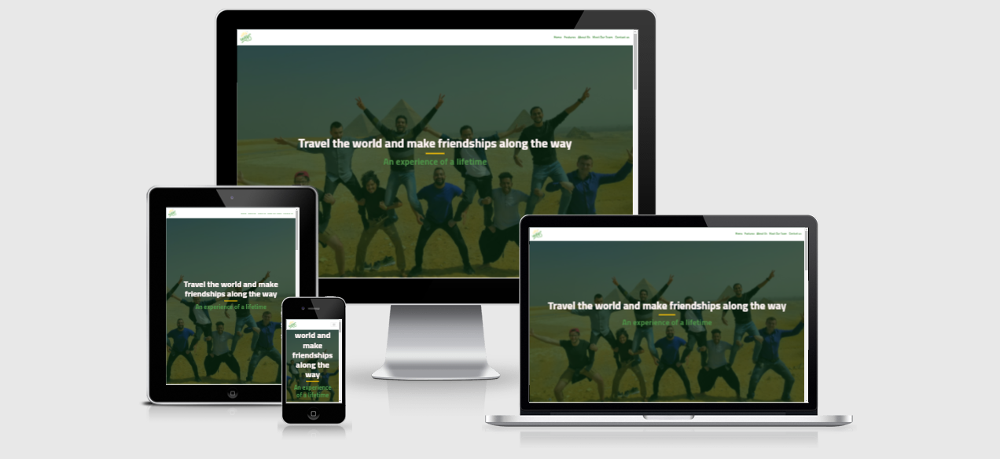
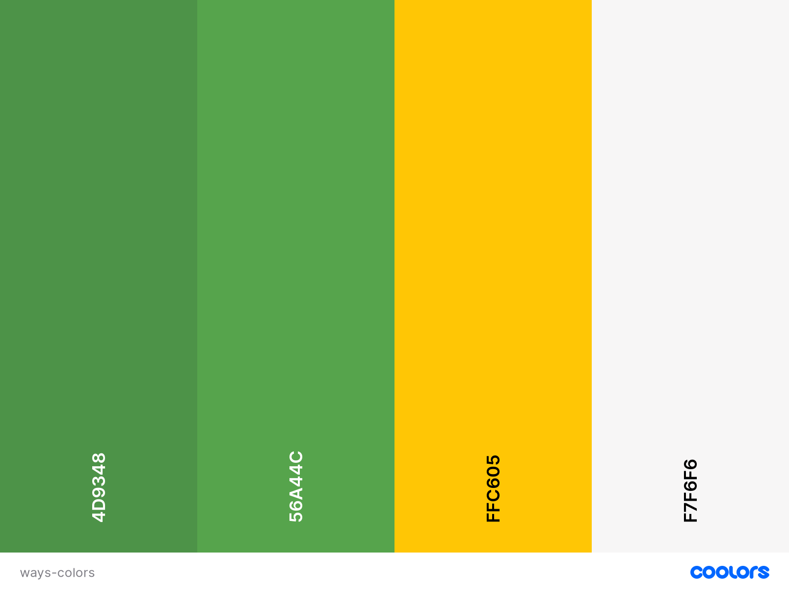

# **Ways**

## **Goal for this project** 

Ways - Experience a new way of travelling
Ways is a NGO engaged in Youth work, primarily focused on hosting and participating in Erasmus+ Youth exchanges and Training courses. 
On this site you can find out what Ways have to offer, what projects are coming up and how to apply for them.
The website will give the users a understanding of what a Youth project is and how it looks like through images and blogs. 

It is important that the users find it easy to navigate and find the information needed to make informed decisions on participation. 

Thank you for visiting my project!
If you have any feedback or questions, head over to my GitHub contact details and feel free to reach out to me.

---

## Table of contents 
- [**Ways**](#ways)
  * [**Goal for this project**](#goal-for-this-project)
  * [Table of contents](#table-of-contents)
  * [**UX**](#ux)
    + [**User Goals**](#user-goals)
    + [**User Stories**](#user-stories)
          + [A first time visitor to this website,](#a-first-time-visitor-to-this-website)
          + [As a returning visitor,](#as-a-returning-visitor-)
    + [**Site owners Goals**](#site-owners-goals)
    + [**User Requirements and Expectations**](#user-requirements-and-expectations)
      - [Requirements](#requirements)
      - [Expectations](#expectations)
    + [**Design Choices**](#design-choices)
      - [Fonts](#fonts)
      - [Icons](#icons)
      - [Colors](#colors)
        * [Changes made to color scheme](#changes-made-to-color-scheme)
      - [Structure](#structure)
  * [**Wireframes**](#wireframes)
    + [**Changes made to wireframes**](#changes-made-to-wireframes)
    + [[Desktop Wireframe](wireframes/desktop_wireframe.png)](#-desktop-wireframe--wireframes-desktop-wireframepng-)
    + [[Tablet Wireframe](wireframes/tablet_wireframe.png)](#-tablet-wireframe--wireframes-tablet-wireframepng-)
    + [[Mobile Wireframe](wireframes/mobile_wireframe.png)](#-mobile-wireframe--wireframes-mobile-wireframepng-)
  * [**Features**](#features)
    + [**Existing Features**](#existing-features)
      - [Navigation](#navigation)
      - [Hero Image](#hero-image)
      - [Welcome Section](#welcome-section)
      - [About us Section](#about-us-section)
      - [Meet the team](#meet-the-team)
      - [Contact](#contact)
      - [Footer](#footer)
    + [**Features to be implemented**](#features-to-be-implemented)
  * [**Technologies used**](#technologies-used)
    + [**Languages**](#languages)
    + [**Libraries & Frameworks**](#libraries---frameworks)
    + [**Tools**](#tools)
  * [**bugs**](#Bugs)
  * [**Testing**](#testing)
  * [**Deployment**](#deployment)
  * [**Credits**](#credits)
    + [Content - Media - Inspiration](#content---media---inspiration)
    + [Acknowledgements](#acknowledgements)

<small><i><a href='http://ecotrust-canada.github.io/markdown-toc/'>Table of contents generated with markdown-toc</a></i></small>

## **UX**

### **User Goals**

* Offer information about Youth
* Website should be easy to use on desktop, tablet & mobile
* Appealing visual elements with connection to youth work
* Personal info of key members of staff
* Offer testimonials through blogs and pictures
* Contact details should be easy to find
* Form to ask questions to the organisation should be visible

[Back to Top](#table-of-contents)

### **User Stories**

#### A first time visitor to this website, 
   - I want to easily navigate around and have a navigation that is easily understood.
   - I want a responsive website on any device, that gives me a good user experience. 
   - I want to understand what the organsation is doing, and how it can contribute to what i am looking for. 
   - I want to see other peoples experiences with the organisation and what they have gotten out of it.
   - I want to easily be able to contact the organisation, if i have any questions.
   

 #### As a returning visitor, 
   - I want to see how i can contribute to the organisation. 
   - I want to quickly be able to see where i can sign up for a project. 
   - I want to know who to contact if i will go into collaboration with the organisation.
   - I want to be able to find pictures and stories from past projects, to see if it is something i fit into. 
   - I want to find the organisations social media accounts, to keep up to date with any communication they are running. 
   - I want to know who the key members are, and how to contact them.

### **Site owners Goals**
* Increase awareness about Erasmus+ Youth projects.
* Increase participation.
* Give young people an opportunity of a lifetime.

[Back to Top](#table-of-contents)

### **User Requirements and Expectations**

#### Requirements
* Easy to navigate by using the navigation menu
* useful information about youth projects
* Appealing visual elements
* Easy way to contact the organisation
* Clear information on how to contact, if users have any questions

#### Expectations 
* When clicking on links (like social media), I expect the page to open in a seperate browser
* I expect that the website looks clean, and that it it easy to understand the information on the website
* I expect that the navigation links work properly, so i am taken, where they say they will take me
* I expect to quickly understand what the website is about, and what i can do with it
* I expect it to be easy to get in contact with the organization, if i have any questions
* I expect to be able to easily navigate around on any device

[Back to Top](#table-of-contents)

### Design Choices
As Ways target youth that want to travel out in Europe, i have tried to keep the colors light and with many colors. Ways already have a [logo](assets/images/ways-logo.png "logo"), and i will use the same colors, as in the logo throughout the side. The colors are mostly used as dividers and details, as the website will be kept clean in a nice white color.  

I have used [Coolors](https://coolors.co/ "Coolors.co") to come up with a color scheme that fits the overall feeling of Ways as a brand. 

#### Fonts
In order to find the fonts that best fit with Ways as a brand, I have visited [Google Fonts](https://fonts.google.com/ "Google Fonts") to explore the various options.
For the overall content I have decided to use the [Montserrat](https://fonts.google.com/specimen/Montserrat?query=monts "Google fonts: Montserrat") font. This font is very neutral, and gives a clean and easy readable text. 
I have chosen a different font for my headings, as i want them to stand out in relation to the rest of the text. The font I chose for this, is the [Cairo](https://fonts.google.com/specimen/Cairo?query=cairo "Google Fonts: Cairo") font.
The Cairo font is not very far visually from the Montserrat font, but enough to make it stand out as different. 

#### Icons
I have used icons from the [Font Awesome library](https://fontawesome.com/ "Font Awesome"). The icons fit with the corresponding features that the users of the website are to understand. The visual aspect will make it easier to make a fast intepretation of what the text is about.
I will make sure that the icons are styled according to the website. The icons will act as a supplement to the text. I will keep them small and clean to not overtake the text, as that is not the intention. 

#### Colors
The color scheme is based on [Ways logo](assets/images/ways-logo.png "Ways logo"). I will emplement the same colors on the website as there are used in the logo. 
You can view my color scheme [here](assets/images/ways-colors.png).
Below I will explain more why I choose the various colors and for what I will be using them.

* #417A3D: This will be used as the color for the headings. It ties back to Ways logo and gives a nice contrast to the white background.
* #56A44C: For the paragraphs i have used a slightly lighter green that also ties back to the logo of Ways. this keeps consistency, but still marks a difference between headings and paragraphs.
* #FFC605: As a divider throughout the page, i have used a smooth yellow, which also ties back into Ways Logo. The yellow color has a nice contrast, and therefore act great as a divider. 
* #F7F6F6: For the background i have used a slightly red shade of white. This is mostly to give a bigger contrast between the green color of the text and the background. 

I have used to contract checker on Coolors in order to make sure that the contract is sufficient.
This way my content will be easily readable. 

##### Changes made to color scheme 
While making the page, it occured that the initial color scheme did not fit well in relation to contrast and overall feel. Colors weere therefore changed, and the colors in this README file are the colors that are represented on the site.

#### Structure
The website structure is built with [Bootstrap](https://getbootstrap.com/).
Bootstrap provides content for both CSS and JavaScript, as functionality with both is important.
As Bootstrap is designed for mobile first, I will be certain that my website functions well on mobile. This also go hand in hand with the target group of Ways, who are young people. They will most likely be using mobiles rather than desktop. 

[Back to Top](#table-of-contents)

--- 

## Wireframes
I have decided to use [Balsamic](https://balsamiq.com/wireframes/) to create wireframes for my website. 
First I created a wireframe for mobile, as the approach is mobile first. Thereafter wireframes for desktop and tablets. 
For my website I have decided to go for a 1 page, as that keeps up with current trends. But it is also to suit the target group, as young people do not want to go through many steps. 
The website will be easy to navigate by using the navigation bar or by scrolling down the page. 

### Changes made to wireframes 
Ways logo has been added to the features section, as it gives a good indication of who the organisation is, and it fit well in.

You can find my wireframes below:

### [Desktop Wireframe](wireframes/desktop_wireframe.png)

### [Tablet Wireframe](wireframes/tablet_wireframe.png)

### [Mobile Wireframe](wireframes/mobile_wireframe.png)

[Back to Top](#table-of-contents)

---

## Features

### Existing Features

#### Navigation
For the navbar I have used Boostrap to create a responsive navbar. 
There is a Logo in the left side of the nav-bar that will always bring you back to the top. 
For the user to easily navigate through the site i have fixed each menu point to the place on the site it corresponds to and fixed the nav bar to the top. In this way the user can always just push the tab in the nav bar, when they wish to find something.

#### Hero Image

I have decided to implement a hero image which spreads over 100% width of the screen. The Hero image is a photo from a project of Ways, in this way showcasing the projects Ways stand for. 
The image will be responsive on desktop and tablet, also filling out 100% of the screen there.

#### Welcome Section

Here I used the grid from Bootstrap to create 3 colums on desktop view. On mobile they change into 3 different sections, and on tablet one of them will be hidden.

#### About us Section

The about us section will have a circled image in the middle with 6 setences around it, that illustrates what kind of organsiation Ways is. 

#### Meet the team

For this section i have used the bootstrap grid to make 5 columns that will all host one team member. in each section there will be a picture and a title of the person.
On tablets only 4 people of the team will be visible and be in two rows. On Mobile the team will be presented one at a time, as the user scrolls down the page. 

#### Contact 
At the contact there will be a form to reach out to us at the organisation, if anyone has any questions. 
Below the form there is a submit button, which also triggers a modal to open up which gives feedback to the user that the form has been successfully submitted.

#### Footer
In the footer there will be a link back to the top of the page. Furthermore there will be links to all the social accounts of the organisation.

### Features to be implemented

* Gallery with pictures from various projects 
* Event calendar with dates of future projects
* interactive map with coming projects and former projects on
* A blog page with stories from former projects 
* A news page, with news relating to Ways and Erasmus + projects in general.

[Back to Top](#table-of-contents)

## Technologies used

### Languages

* [HTML](https://en.wikipedia.org/wiki/HTML)
* [CSS](https://en.wikipedia.org/wiki/Cascading_Style_Sheets)
* [JavaScript](https://en.wikipedia.org/wiki/JavaScript)

### Libraries & Frameworks

* [Font Awesome](https://fontawesome.com/)
* [Bootstrap](https://getbootstrap.com/)
* [Google Fonts](https://fonts.google.com/)

### Tools
* [Git](https://git-scm.com/)
* [GitPod](https://www.gitpod.io/)
* [Balsamic](https://balsamiq.com/wireframes/)
* [W3C HTML Validation Service](https://validator.w3.org/)
* [W3C CSS Validation Service](https://jigsaw.w3.org/css-validator/)

[Back to Top](#table-of-contents)

## Bugs

[Back to Top](#table-of-contents)

## Testing

### A first time visitor to this website

#### User story: I want to easily navigate around and have a navigation that is easily understood. 
* **Plan** 
I want to create a website that is very basic to navigate. My first thought was to make use of the navigation menu to make everything easily accessible over different pages. After some thought and some suggestions, i changed my mind and the plan was then to create a rolling page, as all the information would then be gathered in one place, without the user having to go into different tabs. 

* **Implementation**
For the implimentation of the page i set-up the structure using bootstraps gridsystem. i have given every section an ID that is connected with the navigationbar. Therefore the site can easily be navigated through the menu, which is fixed to the top. 

* **Test**    
When scrolling down through the page, it is easy to navigate through the different sections with help of the navigation. The navigation is easily accesible and the user can go to every section of the page without any issues. 

* **Result**  
The navigation works as planned, and the user is able to navigate without any trouble. 

* **Verdict**  
The test has passed all the criteria and works like planned.

#### User story: I want a responsive website on any device, that gives me a good user experience. 
* **Plan** 
The plan is to follow the resposiveness of the bootstrap framework. This will make the page responsive on every device and give the user a good feeling. 

* **Implementation**  
Too impliment it, i am using the bootstrap grid system. Within that the responsiveness is already built in. It should be working for every section. 

* **Test** 
The responsiveness is overall working well, but the container hieght did not match the expectations i had on all devices. Therefore i had to impliment unique viewport hieghts myself to parts of the website, and mediaquery it out.

* **Result** 
The viewport is as planned, and the overall respinsiveness of the site is working well. There is a small issue with the responsiveness of the meet-our-team section going from tablet to mobile. I did not have time to correct the issue, which has to do with the margin between the collumns. 

* **Verdict** 
The overall responsiveness of the page works very well, but there are small issues, that i have not been able to fix with the meet-our-team section. 

#### User story: I want to understand what the organsation is doing, and how it can contribute to what i am looking for.
* **Plan** 
The user is able to see what Ways stand for, as well as understand what they can get out of going on a project with Ways. Here the About us section and Features section are very important.

* **Implementation**
Too make the user understand what Ways stand for, i have implimented the 3 core things a participant will get out travelling with Ways. For a user to want to interact with us, it is important that the user have the same values as Ways as an organisation. Therefore it has been important to showcase waht Ways stand for. Here the About Us section is very important. Furthermore the pictures are carefully chosen to let the users get an idea of the kind of projects they will participate on. 

* **Test**  
Running through the website, it gives a good flow that the user sees the features before anything else, to give them an idea about what they can acheive through Ways. Through testing i have found that the About Us section does not work in this regard, if each value is not put in bigger writting. Font-size have therefore been increased to 2.6rem. 

* **Result** 
The result of the work is a website with a good overview of the values and features Ways are able to provide. This will become even more clear when [further features](#Features to be implemented) are implimented. 

* **Verdict**  
The test has passed all the criteria and works like planned.

#### User story: I want to see other peoples experiences with the organisation and what they have gotten out of it. 
* **Plan** 
The plan is to impliment features that will showcase this further down the line. At the moment the user will be able to see the users experience among hte background pictures, which are all from already established projects. Further down the line a gallery, blog and showcasing of past projects will be implimented. 

* **Implementation** 
For implimentation current photos on the page have been carefully selected to show the situations a participant can find themselves in. Furtherdown the line, the implimentation of a blog will be key, as it gives the past participants a voice, that the new participants can pick up. 

* **Test**   
For testing at the moment this User story is not fully complient with the users experience, as the users do not get a full view of the users experience. With the current sections the users are getting a overview of what they can get out of Ways and what Ways stand for. 

* **Result**
The result is a user that are missing a link. The user might still be inclined to push through to participate in a project, but it is less likely, without this user story fullfilled. 

* **Verdict**    
The test has passed all the criteria as planned, but will need further work to function properly. 

#### User story: I want to easily be able to contact the organisation, if i have any questions.
* **Plan** 
The planned feature is a contact form at the bottom of the page, where the user will be able to ask any questions they might have. The contact form should be easy to access and not course the user any trouble. 

* **Implementation** 
The implimentation is done through bootstraps build in modules, and then styled accordingly to the theme of the page. There will be 3 input fields. One for name, one for email and then one for the inquery they are asking about. All 3 fields will be requered to fill out. 

* **Test** 
While testing the solution on every device, it is clear that the background image does not render well on mobile. The positioning of the image have been moved, to fit better on the page. Besides that, everything works as anticipated. 

* **Result** 
The result is that the user can find the form at the end of the page. At this stage the user is not able to send on inqueries, as their is not server to send responses to. This will change at a later stage. 

* **Verdict**     
The test has passed all the criteria and works like planned.

[Back to Top](#table-of-contents)

## Bugs 

### The fixed menu covers the headings of my elements
During testing it became apparent that the fixed navigation bar would cover the headings of some of my sections. This was fixed using a bigger margin on the headers, so they are moved under the navigation bar. 

### The pictures does not sit well on mobile
While testing it became apparent that the pictures would have to be moved, to fit better on the screen on mobile. Therefore every picture was moved, so the right perspective where centered. 

[Back to Top](#table-of-contents)

## Deployment

I deployed my Ways project website in the following way:

* Logged in to my GitHub account and locating my repository
* Clicked on the settings icon (near the top right of the page)
* Scrolled down the page to locate the 'GitHub Pages' section
* I selected 'Master branch' in the dropdown
* This deployed my project to the URL: (https://daniellima338.github.io/Ways/)

[Back to Top](#table-of-contents)

## Credits

### Content - Media - Inspiration

As Ways already have a [website](https://waysforyouth.dk/), i have used the website for inspiration. Furthermore i have drawn inspiration from the 3 miniprojects done on the Code Institute course, before this project. 
Lastly i have drawn inspiration for my README file from [AnoukSmet](https://github.com/AnoukSmet/Naturazy), as the template has been drawn from her project. 

Pictures are from Ways projects and Ways have the right to all of them. 

### Acknowledgements

First and foremost i want to thanks [Ways](https://waysforyouth.dk/), for letting me borrow their name, pictures and general inspiration for this project. It has really been usefull to have all assets at hand, and not have to worry about copyrights. 
Secondly i want to thank my mentor [Eventyret_mentor](https://github.com/Eventyret) for very valuable advice. Thank you for always being very constructive and easy going. 

[Back to Top](#table-of-contents)

